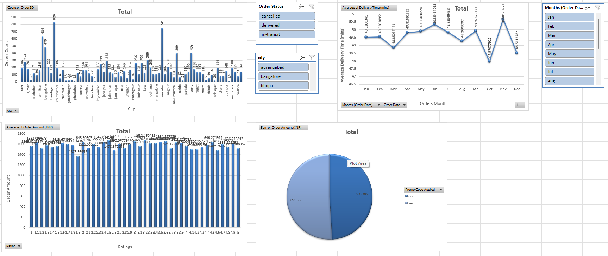
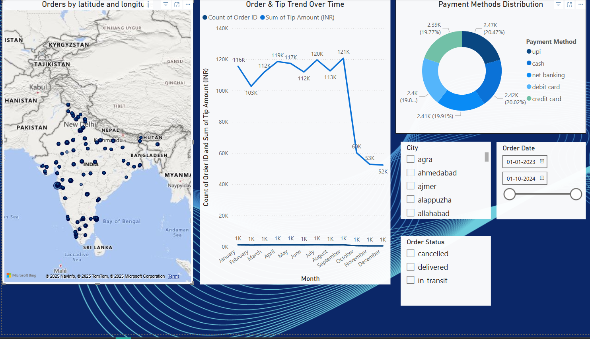

# 🍽️ Final Insights – Zomato-Style Food Delivery Data Analysis

## 📊 Overview

This analysis explored user behavior, restaurant performance, and delivery logistics using a cleaned dataset of Zomato food delivery orders. The findings were visualized using **Excel** and **Power BI** dashboards, leading to actionable business recommendations.

---

## 1️⃣ Customer Behavior Insights

- 💡 **Tip Trends**: Tips peak on **Fridays** and **Mondays**.  
  🔧 *Strategy*: Offer special deals or reward incentives to delivery partners on these days to maintain high satisfaction and performance.

- 💡 **Tip Drivers**: Customers tend to tip more when delivery is:
  - **Fast**
  - **Free**
  - **Short-distance**
  
  🔧 *Strategy*: Promote free delivery for short-distance orders and improve routing algorithms for efficiency.

- 💡 **Peak Hours**: Most orders occur between **11 AM and 11 PM**.  
  🔧 *Strategy*: Scale delivery fleet and apply smart surge pricing during these hours.

---

## 2️⃣ Restaurant Performance

- 💡 **Rating vs Price**: High-priced restaurants generally have higher customer ratings.  
  🔧 *Strategy*: Promote premium restaurants to high-value users during festive periods or weekends.

- 💡 **Cuisine Type Ratings**: **Irani Cafes** and **Fine Dining** score the highest in average ratings.  
  🔧 *Strategy*: Highlight these restaurants on the app homepage and include them in curated lists.

- 💡 **Top Cuisine by Order Volume**: **Bakery** has the most orders.  
  🔧 *Strategy*: Onboard more bakery vendors and offer combo deals to capitalize on demand.

---

## 3️⃣ Delivery Logistics

- 💡 **Distance-Time Correlation**: A strong positive correlation between delivery distance and time.  
  🔧 *Strategy*: Use this insight to enhance route optimization and time estimation models.

---

## 4️⃣ Marketing Analytics

- 💡 **Free Delivery Effect**: Drives better ratings and tips.  
  🔧 *Strategy*: Use free delivery promotions during low-order periods to boost traffic and feedback.

- 💡 **Promo Code Impact**: Boosts order volume but doesn’t significantly increase tips.  
  🔧 *Strategy*: Use promo codes selectively, especially during competitive events (e.g., IPL matches, holidays).

---

## 📈 Dashboard Highlights

- **Excel Dashboard**  
  Designed to deliver actionable insights into **cost patterns by customer ratings**, **promo code usage**, **order volume by city**, and **monthly delivery performance**.  
  Visuals include bar charts, pie charts, and slicers for dynamic filtering.

  

- **Power BI Dashboard**  
  An interactive dashboard showcasing **order distribution by location**, **monthly trends in orders and tips**, **payment method analysis**, and slicers for **city**, **order status**, and **date range** to support dynamic filtering.

  

These dashboards enabled real-time slicing of data by day, restaurant type, and order characteristics, supporting more granular business decisions.

---

## ✅ Conclusion

This project converted raw data into strategic insights by combining:
- Exploratory Data Analysis (EDA)
- Interactive Dashboards (Excel + Power BI)
- Actionable Business Recommendations

📌 **Benefits if implemented**:
- Increased customer retention
- Higher delivery efficiency
- Improved restaurant discoverability
- Smarter and more cost-effective marketing

---

🔍 **Tools Used**: Python, Pandas, MySQL, Excel, Power BI    

